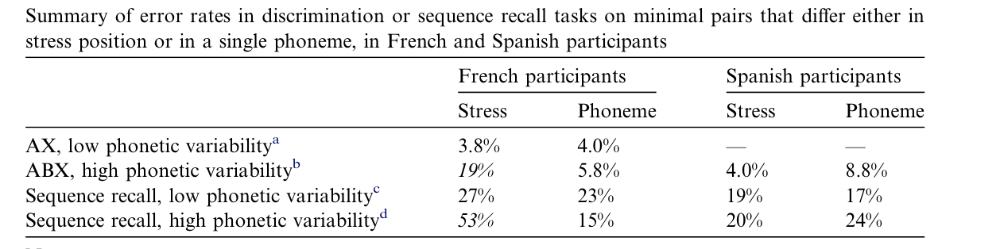
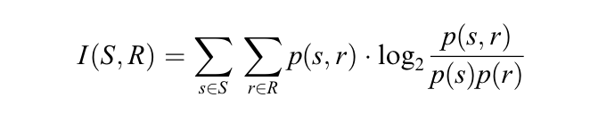
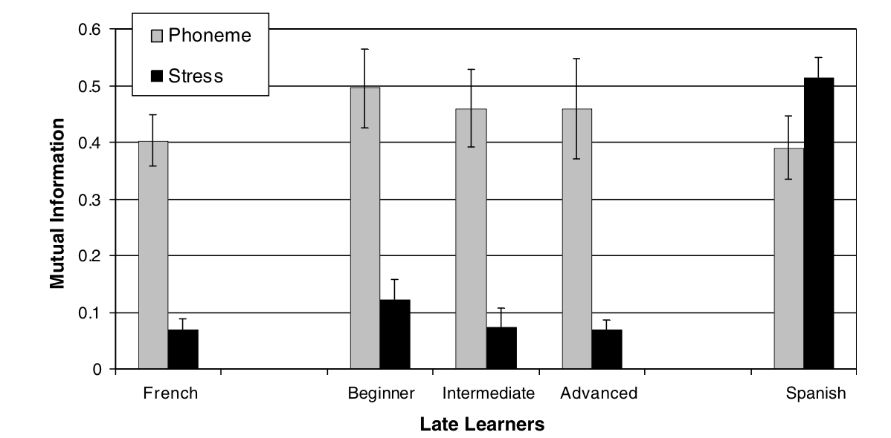
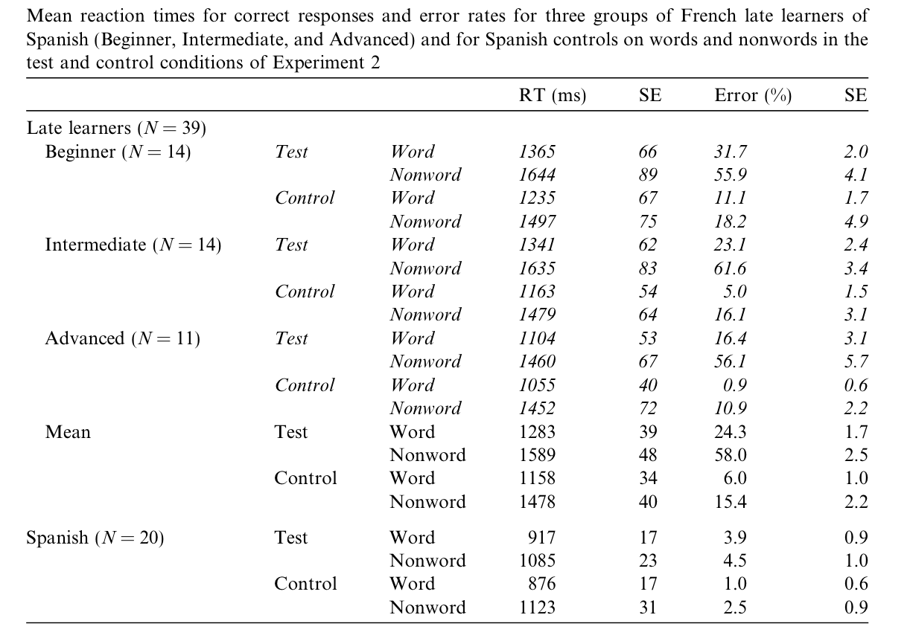

## L2 acquisition

- There are phonological difficulties for a second language learner in both production and perception 

- Models that account for this include: 
   - Perceptual warping: some acoustic cues are enhanced or reduced depending on their functional values in the native language 
   - Reliance on phonological features: when a non-native contrast cannot be parsed in terms of a contrastive feature of the native language, perceptual problems arise
    - Perceptual difficulties are due to the interference from the native phoneme categories or prototypes 
    
- These perceptual differences have been tested  with segmental aspects of speech, but fewer work has been done in the perception of suprasegmentals 

The aim of this study: study the perception of stress in L2 learners of Spanish 

--- 

## Stress

- Stress is a suprasegmental that can be characterized by:
    - F0
    - duration
    - intensity 

- These cues convey information of the prosodic structure, pragmatic content, emotional state 

- It is also be used as a contrastive feature in many languages 
    - Spanish makes use of it 
        - bebe vs. bebé
    - French does not utilize stress in a contrastive manner 
        - it is used alophonically in vowels after some consonants 
        - it also has phrasal accent: final syllable lengthening

---

## Are French speakers able to process contrastive stress in Spanish? 

- In standard discrimination tasks, with little variability, they perform similar to Spanish-speaking monolinguals 
- But in a sequencing task, where there is a load on memory, French participants have a strong impairment in processing contrastive stress 

  

- Could this performance be due to the fact that the French listeners do not have metalinguistic access to stress?
- Solution: test French learners of Spanish who have had explicit training in the contrastive nature of stress in the language

---

## Is the performance pattern of French listeners due to a processing deficit or to a metalinguistic limitation?

- Processing deficit: French learners of Spanish should behave similarly to French monolinguals 

- Metalinguistic limitation: French learners of Spanish should perform better than French monolinguals 

---

## Tasks

- Stress encoding in short-term memory 
    - sequence recall task with high phonetic variability 
    
- Stress encoding in the lexicon
    - lexical decision task

---

## Sample

- 39 native French speakers who are late learners of Spanish 
    - 11M 28F  
- Age: 20-57(m=28)
- 33 undergraduate students in Barcelona
- 6 were tested in Paris
- All learned Spanish after age 11
- Classification of participants:
    - beginner (n=14)  
    - intermediate (n=14) 
    - advanced (n=11)

---

## Criteria

- Criteria for classification:
    - Language background questionnaire 
        - age/place/manner of acquisition 
        - length of residency in Spanish-speaking country
        - usage of Spanish (private,professional) 
    - Language assessment
    - Self evaluation on competence (1-10): 
        - pronunciation
        - grammar
        - vocabulary
        - production competence 
    - Read aloud short story 
        - participants were rated by native spanish speakers (1-6)

---

## Controls

- 20 native French speakers
    - 7M 13F
- 20 native Spanish speakers 
    - 3M 17F

---

## Task 1: Sequence recall task with high phonetic variability 

- Two nonword minimal pairs were constructed 
    - segmental contrast: /fiku-fitu/
    - stress contrast: / númi-mumí/
- The stimuli was recorded by 3 male and 3 female French speakers 
    - high phonetic variability 

--- 

## Task 

- Training task:
    - the participants listened to the minimal pair as much as they wanted 
    - they were  explicitly trained on the distinction between the two items and were taught an association with a number key 

- Experimental task: 
    - 4 warm-up trials and 28 test trials 
    - the participants listened to a sequence and were asked to reproduce it by typing the associated keys in the correct order 
    - each participant did both the segmental and suprasegmental conditions

---

## Results 

Mean error rates were analyzed with ANOVAs in each group separately and then with a combined ANOVA 

- Both French monolinguals and late learners had significantly more errors in the stress condition than in the phoneme condition 
    - F(1, 19) = 122.5, p < .001; F(1, 35) = 174.5, p < .001
- No effect of group (french monolinguals and late learners)
    - F(1,54)= 1.9, p >.1
- Spanish monolinguals: no significant effect of contrast 
    - F(1,19)=2.1, p> .1
- Interaction between Contrast and Group when the Spanish controls were compared to the French monolinguals and the late learners 
    - french monolinguals: F(1,38) = 91.2 p< .001
    - late learners: F(1,54)=91.3, p< .001

---

## Results 

- French learners: no effect of practice 
    - no interaction between Practice and Contrast 
        - F(2,33)= 1.4, p >.1
    - all subgroups showed a significant difference between contrasts 
        - beginners: F(1,13)=45.5, p<.001
        - intermediate: F(1,12)=116.9, p<.001 
        - advanced: F(1, 8) = 37.4, p < .001

---

## Mutual information 

- Sequence responses were recorded correct or incorrect so that in a sequence a single mistake counts as much as a series of mistakes 
- Global error rates may be hiding a slight improvement in the encoding of stress 
- Mutual information values were computed between the individual targets and the individual responses over the entire test trials, for each participant and condition

  

---

## Mutual information scores 

  

---

## ANOVAs on mutual information 

- Both French monolinguals and late learners had lower mutual information in the stress condition compared to the phoneme condition
    - French monolinguals: F(1, 19) = 38.9, p < .001 
    - late learners: F(1, 35) = 84.3, p < .001 
- The two groups did not differ: no effect of group or an interaction between Group and Contrast ( both F<1)
- Spanish monolinguals: effect in the opposite direction, higher mutual information for stress than phoneme 
    - F(1,19)=4.7, p<.05
- Interaction between Group and Contrast when compared to French monolinguals and late learners 
    - French Monolinguals: F(1,38)=34.4, p<.001
    - late learners:F(1,54)= 59.5, p<.001)

---

## Task 2: Lexical decision task

The researchers designed a lexical decision task in order to test whether the difficulty with the perception of stress is not limited to short-term memory tasks, but extends to the use of stress for on-line lexical access

- Test items: 112 word-nonword pairs that differed only in the position of stress (/góro/ */goró/)
- Controls: 40 word- nonword pairs that differed only in one phoneme (/klase/ */blase/)
- Two stimuli lists were created, each with: 
    - 56 test words
    - 56 test nonwords
    - 20 control words
    - 20 control nonwords
- The lists were created such that if a real word was included in one list, the corresponding nonword was included in the other list 

---

## Results: Test condition

  

Two ANOVAs  on the error rates by participant (F1) and by items (F2)
- Main effects of Lexical Status and Group 
    - Status: F1(1, 57) = 110.8, p < .001; F2(1, 103) = 76.3, p < .001  
    - Group:  F1(1, 57) = 293.6, p < .001; F2(1, 103) = 1175.4, p < .001
- Interaction of the two factors 
    - F1(1, 57) = 62.8, p < .001; F2(1, 103) = 102.3, p < .001

*note that groups= Spanish monolinguals & late learners

---

## Results: Control condition 

  

- Significant effects of Group and Lexical Status 
    - Group: F1(1, 57) = 21.2, p < .001; F2(1, 78) = 44.9, p < .001 
    - Lexical Status: F1(1,57)=22.6, p<.001; F2(1,78)=11.2, p<.001  

### Within late learners of Spanish 
- Significant effects of Practice with beginners making more errors than the advanced learners, the intermediated learners fall in-between
    - F1(2, 36) = 3.7, p < .04; F2(2, 156) = 8.3, p < .001
- ANOVAs on the reaction times revealed significant effects of Group and Lexical Status ,but no interaction between the two (F < 1).  
    - Group: F1(1, 57) = 39.8, p < .001; F2(1, 78) = 454.7, p < .001
    - Status: F1(1, 57) = 206.4, p < .001; F2(1, 78) = 101.8, p < .001

---
## Is the performance pattern of French listeners due to a processing deficit or to a metalinguistic limitation?
- Processing limitation (French learners of Spanish should behave similarly to French monolinguals)
    - sequence recall task: late learners were undistinguishable from the French monolinguals controls and the did not show an effect of practice 
    - lexical decision: late learners' error rates on minimal pairs that differ on stress were very high 
        - in the control condition with minimal pairs involving phonemic distinction, advanced learners made less errors than beginners     

---

### Other conclusions

- It is necessary to test participants in a range of tasks when testing the processing of L2 contrasts 
-  Speech perception models that highlight the influence of native phonological features best account for the present results 
    - because French does not have a contrastive suprasegmental feature the minimal pairs cannot be differentiated with the use of an existing L1 feature

---

## Reference 

Dupoux, E., Sebastián-Gallés, N., Navarrete, E., & Peperkamp, S. (2008). Persistent stress ‘deafness’: The case of French learners of Spanish. Cognition,106(2), 682-706.

---

  

  

